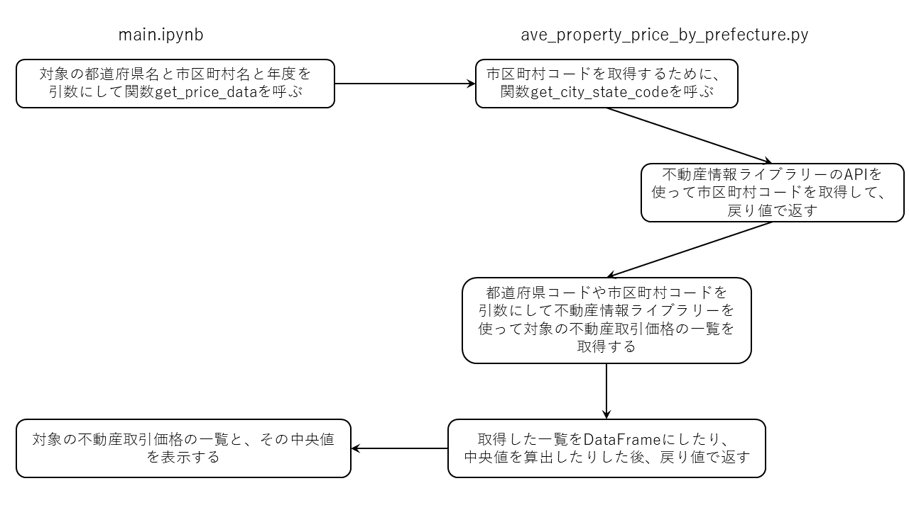

# このフォルダのプログラムについて

このフォルダのmainプログラム(main.ipynb)は、不動産取引価格を取得するプログラム(ave_property_price_by_prefecture.py)を呼び出して、不動産取引価格を取得しています。

## 概要

不動産取引価格を取得するプログラム(ave_property_price_by_prefecture.py)は、不動産情報ライブラリー(<a href="https://www.reinfolib.mlit.go.jp/">https://www.reinfolib.mlit.go.jp/</a>)のAPIを使って不動産取引価格を取得した後、取得した不動産取引価格の一覧と、その価格の中央値を返すプログラムです。

以下に、main.ipynbとave_property_price_by_prefecture.pyの概要図と処理フローを示す図を掲載します。

